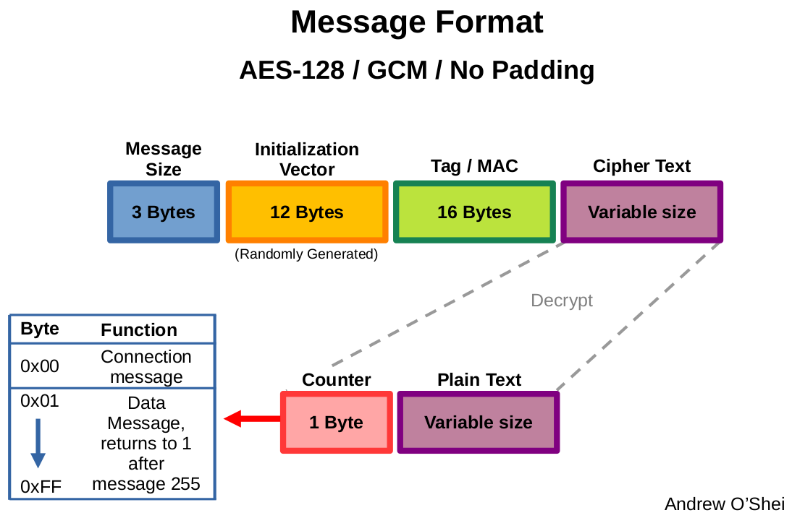
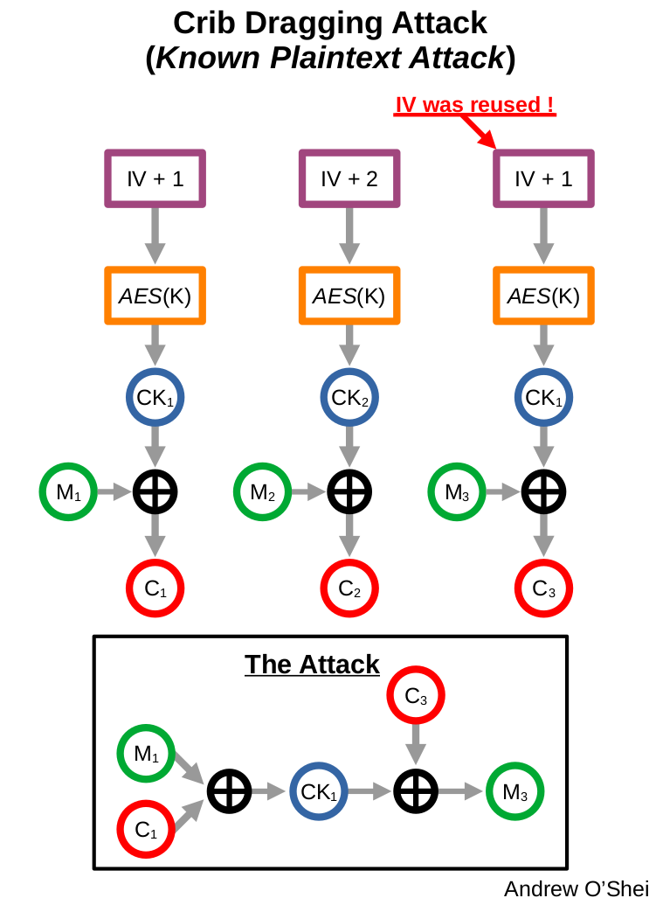
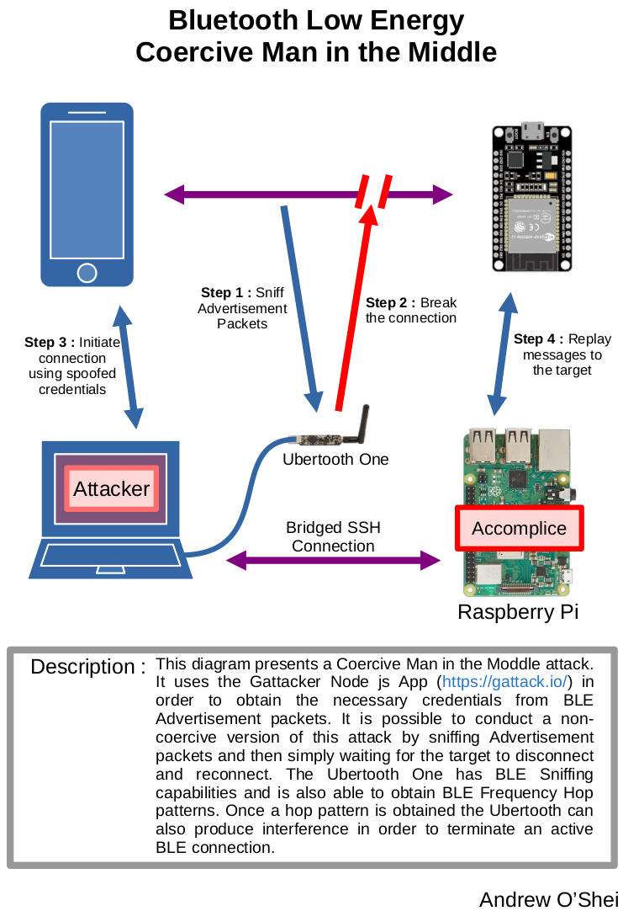
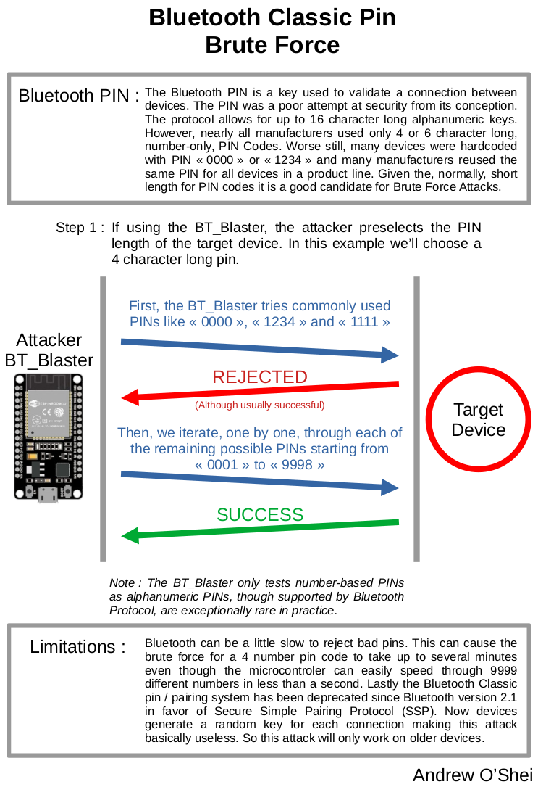
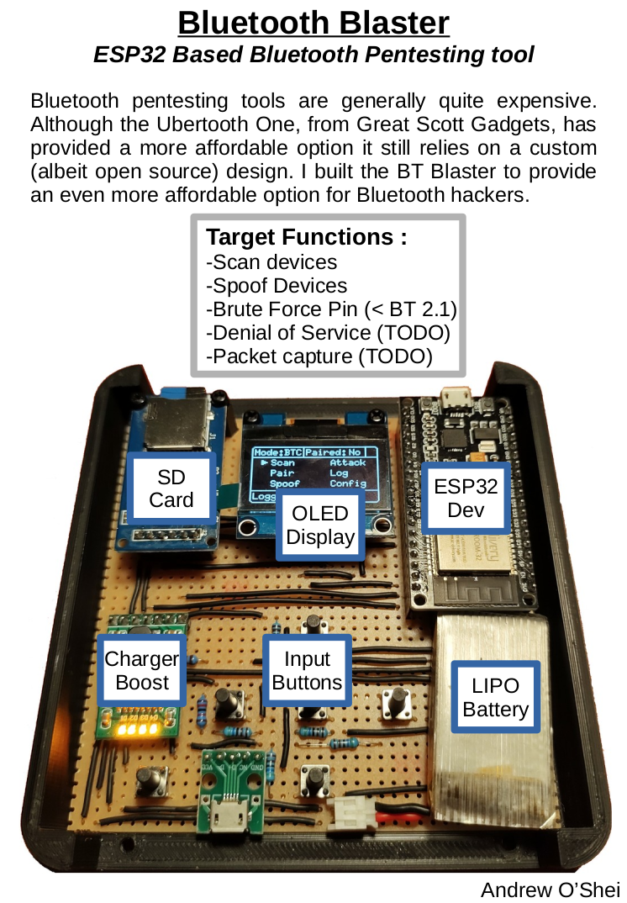

# Embedded Security Project
This is a university project researching security for embedded systems. I take a look in particular at using Bluetooth Classic and Bluetooth Low Energy as a means to exploit embedded systems. Testing is based around an Android messaging application that communicates with an ESP32. The Android application was modified from my ColorTooth project in order to provide a platform for testing different cryptographic algorithms. The current version is based around Bluetooth Low Energy and employs an AES-GCM hybrid block cipher algorithm for encrypting the messages passed between the Android app and the ESP32.

## Included Packages:
* **Messenger BLE** - Android app for sending and receiving encrypted messages over Bluetooth LE.
	1. Messages are encrypted using AES 128-bit / GCM Encryption.
	2. Bluetooth LE and AES-128 bit were chosen to reflect a resource constrained system.
	3. App allows scanning for BLE devices and returns a list of devices, MAC addresses and RSSI. signal strength.
	4. TODO: Implement AI model for detecting attacks (Tensorflow).
* **ESP32 BLE Blaster** - Firmware for the ESP32 counterpart to the Messenger BLE Android App.
	1. Send and receive text messages over Bluetooth Low Energy.
	2. Messages are encrypted using AES 128-Bit in Galois Counter Mode (GCM).
	3. Allows scanning BLE Devices and Logs their data to an SD Card in Json format.
	4. OLED Display allows real time feed back of connection status and received messages.
* **ESP32 Pentester** - An attempt at building a Bluetooth Classic pentesting tool out of an ESP32. Note: The ESP32 Pentester (or BT_Blaster as I called it) is in an unfinished state. The ESP32-IDF SDK is fairly limited in terms of Bluetooth Classic functionality. Reverse engineering it to add all of the desired functions is beyond the scope of this project.
	1. Features OLED Screen, SD Card Reader and LiPo battery with charging circuit for a fully portable design.
	2. Scan for Bluetooth Classic devices.
	3. Spoof Bluetooth Classic Devices.
	4. Brute Force Bluetooth Classic Pins (Only works on devices before Bluetooth 2.1).
* **Dataset Constructor** - This is a python script for processing BTLE PCAP files in preperation for training a neural network. PCAP packets are parsed into samples which are grouped based on capture time.
	1. Can process files individually or in a batch.
	2. The script parses data of interest in pcap files and flags if they were captured during an attack.
	3. User can set the sample size via a command line argument.
	4. The final result is output as a CSV file.
* **CNN Training Models** - Includes Tensorflow scripts for the different convolutional neural network models I used to test the BTLE network data.
* **Bluetooth Sniffer Modified** - Modified version of nordic BTLE Sniffer. It allows synchronizing simulated attacks with pcap packet collection. The end result is it allows me to automate the process of collecting and parsing data.

### Other Packages
* **Messenger BT Classic** - Same as Messenger BLE but using Bluetooth Classic. Note: Scanning of devices is not handled in App. This is a limitation of Android, which only allows Bluetooth Classic pairing through the OS Utility.
	1. Send and receive messages over Bluetooth Classic.
	2. Employs AES128-GCM Encryption
* **Receiver AES128-GCM Firmware** - ESP32 firmware, the ESP32 based counter part to Messenger BT Classic.
	1. Receives messages and then replays the message to the sender.
* **Receiver AES128-GCM DoubleIV Test** - A version of the ESP32 Firmware where the encryption algorithm is broken and intentionally uses the same initialisation vector for every message. It was used to demonstrate a Crib Dragging attack.
	
## Related Documentation:

Example of message format used in Messenger BLE Android App:

Android by default enforces random generation of initialization vectors (IV) for ciphers. Although this is generally a good idea, it does open up the remote possibility of reusing an IV. This demonstrates how one could use this possibility to decrypt cipher text. 

Demonstration of a Man in the Middle attack on Bluetooth LE using an Ubertooth One:

Demonstration of how the Spoofing function works on the BT_Blaster:

Demonstration of how the BruteForce function works on the BT_Blaster:

Overview of my BT_Blaster prototype:

