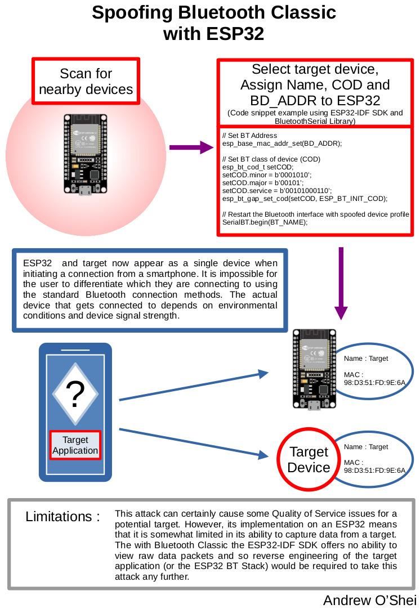

# Embedded Security Project
This is a university project researching security for embedded systems. I take a look in particular at using Bluetooth Classic and Bluetooth Low Energy as a means to exploit embedded systems. Testing is based around an Android messaging application that communicates with an ESP32. The Android application was modified from my ColorTooth project in order to provide a platform for testing different cryptographic algorithms. The current version is based around Bluetooth Low Energy and employs an AES-GCM hybrid block cipher algorithm for encrypting the messages passed between the Android app and the ESP32.

## Included Packages:
* Messenger BLE - Android app for sending and receiving encrypted messages over Bluetooth LE.
	1. Messages are encrypted using AES 128-bit / GCM Encryption.
	1. Bluetooth LE and AES-128 bit were chosen to reflect a resource constrained system.
	1. App allows scanning for BLE devices and returns a list of devices, MAC addresses and RSSI. signal strength.
	1. TODO: Implement AI model for detecting attacks (Tensorflow).
* AES-GCM\_Firmware_BTLE - ESP32 Firmware, this is the ESP32 implementation of the Android Messenger BLE.
	1. Like Messenger BLE, Messages are encrypted using AES 128-bit / GCM Encryption.
* Messenger\_BT_Classic - Same as Messenger BLE but using Bluetooth Classic. Note: Scanning of devices is not handled in App. This is a limitation of Android, which only allows Bluetooth Classic pairing through the OS Utility.
* ESP32 Pentester - An attempt at building a Bluetooth Classic pentesting tool out of an ESP32. Note: The ESP32 Pentester (or BT_Blaster as I called it) is in an unfinished state. The ESP32-IDF SDK is fairly limited in terms of Bluetooth Classic functionality. Reverse engineering it to add all of the desired functions is beyond the scope of this project.
	1. Features OLED Screen, SD Card Reader and LiPo battery with charging circuit for a fully portable design.
	1. Scan for Bluetooth Classic devices.
	1. Spoof Bluetooth Classic Devices.
	1. Brute Force Bluetooth Classic Pins (Only works on devices before Bluetooth 2.1).
	
## Related Documentation:

